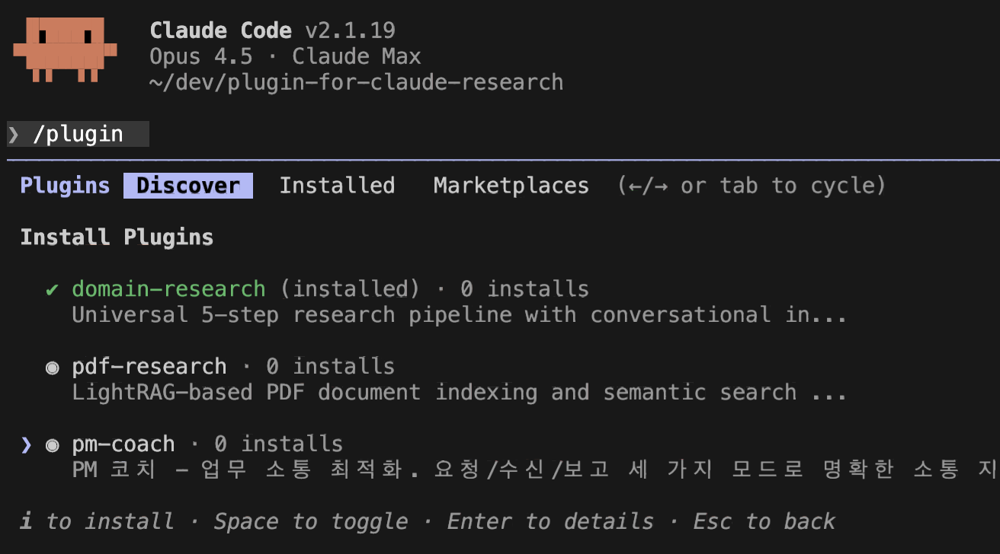
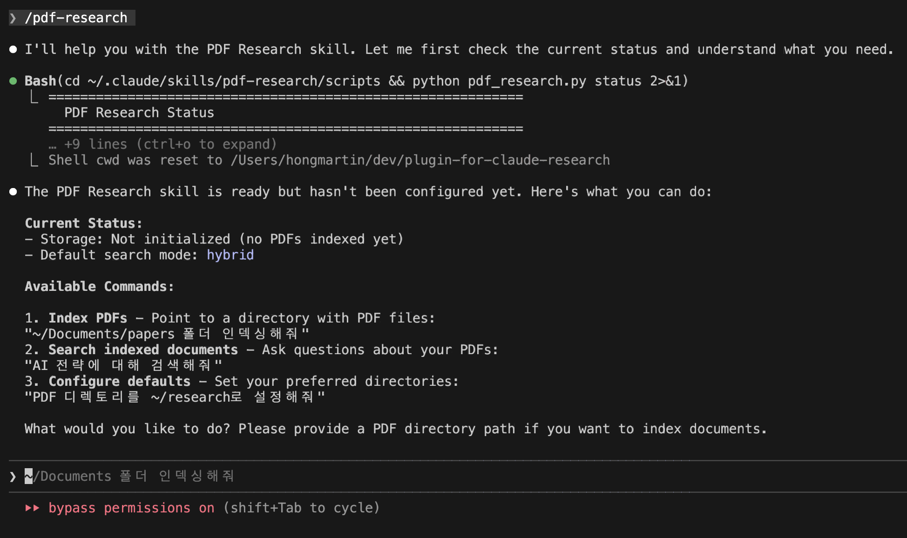

<p align="center">
  
</p>

# Claude Research Framework

> **한국어 안내**
> Claude Code에서 **체계적인 리서치**를 도와주는 플러그인 모음입니다.
>
> **포함된 플러그인:**
> - **domain-research**: 대화형 리서치 파이프라인 (어떤 분야든 적용 가능)
> - **pdf-research**: PDF 문서 인덱싱 및 시맨틱 검색 (LightRAG 기반)
> - **pm-coach**: PM 업무 소통 최적화

---

A collection of **research plugins** for Claude Code that help you conduct systematic research through conversational analysis and semantic document search.

## Plugins

| Plugin | Description | Use Case |
|--------|-------------|----------|
| **domain-research** | 5-step research pipeline with conversational intent analysis | Any domain research |
| **pdf-research** | LightRAG-based PDF indexing and semantic search | Document analysis |
| **pm-coach** | PM communication optimization (Korean) | Task communication |

---

## Quick Start

### Installation

```bash
# Add this marketplace to Claude Code
/plugin marketplace add hongsw/plugin-for-claude-research

# Install plugins
/plugin install domain-research
/plugin install pdf-research
/plugin install pm-coach
```

### Usage

**Domain Research:**
```
You: "I'm interested in AI for healthcare"
Claude: [Conversational discovery → Research context → 5-step pipeline]
```

**PDF Research:**
```
You: /pdf-research ~/Documents/papers 인덱싱해줘
Claude: [Indexes PDFs → Enables semantic search]

You: AI 인재 전략에 대해 알려줘
Claude: [Searches indexed documents → Returns relevant insights]
```

---

## Screenshots

### PDF Research 워크플로우

<p align="center">
  
</p>

**Screen 3: PDF Research 상태 확인**
- `/pdf-research` 명령어로 스킬 실행
- 현재 설정 상태 확인 (PDF 디렉토리, 스토리지, 검색 모드)
- 사용 가능한 명령어 안내 (Index, Search, Configure)

<p align="center">
  
</p>

**Screen 4: PDF 인덱싱 및 검색**
- PDF 폴더 지정 후 자동 인덱싱
- LightRAG 기반 시맨틱 검색 실행
- 검색 결과에서 관련 문서 내용 추출

---

## Plugin Details

### 1. Domain Research

Universal research framework that guides users from broad exploration to specific domain research.

**Features:**
- Conversational intent discovery
- 5-step research pipeline
- MCP integration (WebSearch, Sequential)
- Works for any domain

**Pipeline:**
1. Conversational Intent Analysis
2. Key Question Generation
3. Research Gap Identification
4. Multi-Source Synthesis
5. Practical Application

### 2. PDF Research

LightRAG-based semantic search over PDF documents.

**Features:**
- PDF text extraction and chunking
- Knowledge graph construction
- Vector embeddings (OpenAI)
- Multiple search modes (hybrid, local, global, naive)

**Commands:**
```bash
# Configure
python pdf_research.py config --pdf-dir /path/to/pdfs

# Index
python pdf_research.py index

# Search
python pdf_research.py search "your question"

# Status
python pdf_research.py status
```

**Requirements:**
- Python 3.10+
- OpenAI API key
- Dependencies: `lightrag-hku[api]`, `pymupdf`, `python-dotenv`

### 3. PM Coach

PM communication optimizer for Korean users.

**Modes:**
- Request mode: 요청 최적화
- Receive mode: 수신 정리
- Report mode: 보고서 작성

---

## Directory Structure

```
plugin-for-claude-research/
├── .claude-plugin/
│   ├── plugin.json              # Marketplace metadata
│   └── marketplace.json         # Plugin registry
├── plugins/
│   ├── domain-research/         # Research pipeline plugin
│   │   ├── skills/domain-research/
│   │   │   ├── SKILL.md
│   │   │   └── prompts/
│   │   └── bin/install.js
│   ├── pdf-research/            # PDF semantic search plugin
│   │   ├── skills/pdf-research/
│   │   │   ├── SKILL.md
│   │   │   ├── prompts/
│   │   │   └── scripts/         # Python CLI tools
│   │   └── bin/install.js
│   └── pm-coach/                # PM communication plugin
│       └── commands/
├── templates/                   # Research input templates
└── README.md
```

---

## Domain Research Pipeline

### Step 0: Conversational Intent Analysis
Start with dialogue, not forms. Adaptive questioning based on user clarity.

### Step 1: Key Question Generation
Generate 5 testable, meaningful research questions.

### Step 2: Research Gap Identification
Identify underexplored areas and emerging opportunities.

### Step 3: Key Insight Extraction
Deep analysis of individual sources.

### Step 4: Multi-Source Synthesis
Integrate findings across sources.

### Step 5: Practical Application
Transform insights to actionable items.

---

## PDF Research Search Modes

| Mode | Best For | Description |
|------|----------|-------------|
| `hybrid` | General queries | Combined local + global (default) |
| `local` | Specific facts | Names, numbers, definitions |
| `global` | Summaries | Themes, trends, overviews |
| `naive` | Exact terms | Simple keyword matching |

---

## User Types Supported

### "I know exactly what I want"
```
You: "I want to research computer vision for quality inspection"
→ 2-3 clarifying questions → Research context ready
```

### "I have a vague idea"
```
You: "I'm interested in AI for my factory"
→ Discovery questions → Focused direction → Context ready
```

### "I want to search my documents"
```
You: /pdf-research ~/papers 인덱싱해줘
→ PDF indexed → Semantic search enabled
```

---

## MCP Server Integration

| Server | Purpose | Triggers |
|--------|---------|----------|
| WebSearch | Real-time discovery | Trend analysis, gap validation |
| Sequential | Complex analysis | Synthesis, action planning |
| Context7 | Documentation lookup | Patterns, best practices |

---

## Requirements

### Domain Research
- Claude Code CLI

### PDF Research
- Python 3.10+
- OpenAI API key (`OPENAI_API_KEY`)
- Dependencies:
  ```bash
  pip install lightrag-hku[api] pymupdf python-dotenv
  ```

---

## Contributing

Contributions welcome! Areas of interest:
- New domain examples
- Prompt refinements
- Additional plugins
- Language support

---

## License

MIT License - see LICENSE file for details.

---

## Acknowledgments

- Inspired by [plugins-for-claude-natives](https://github.com/team-attention/plugins-for-claude-natives/)
- PDF search powered by [LightRAG](https://github.com/HKUDS/LightRAG)
